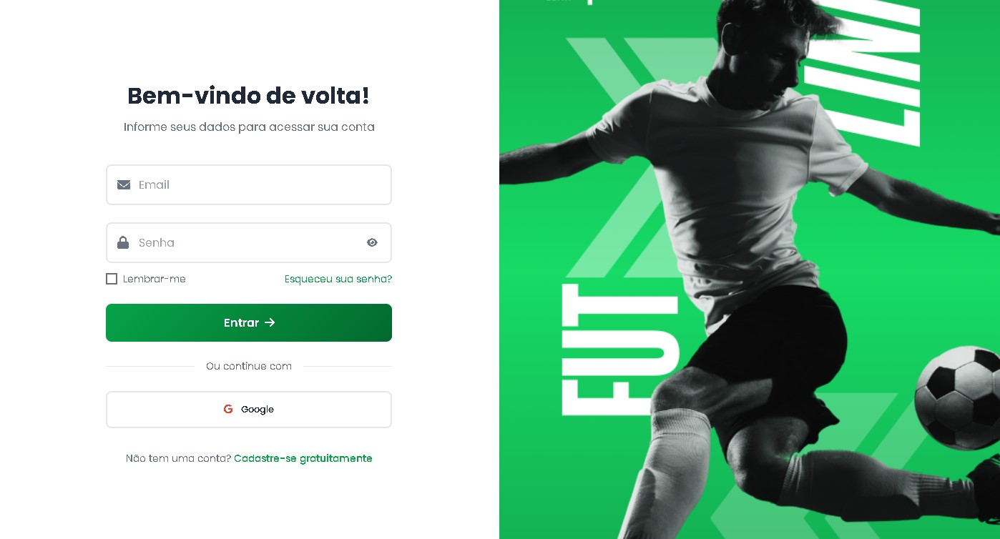
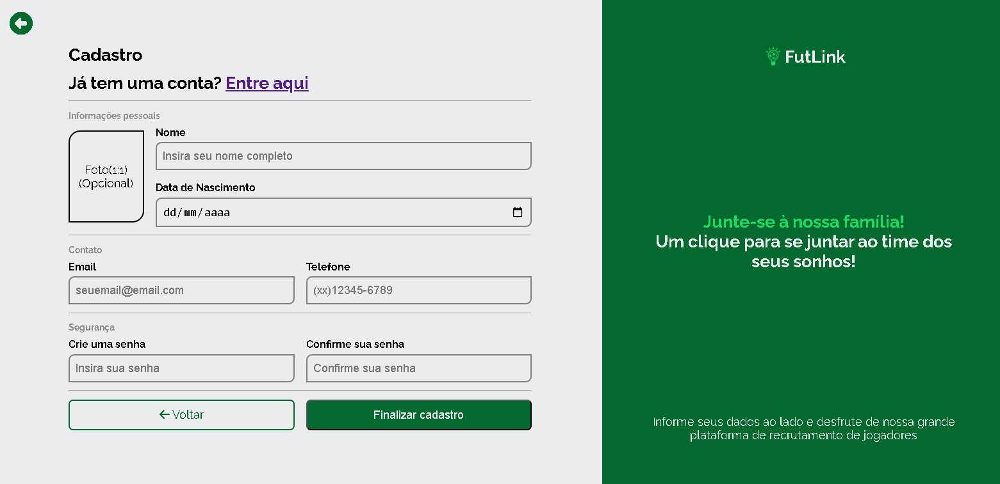
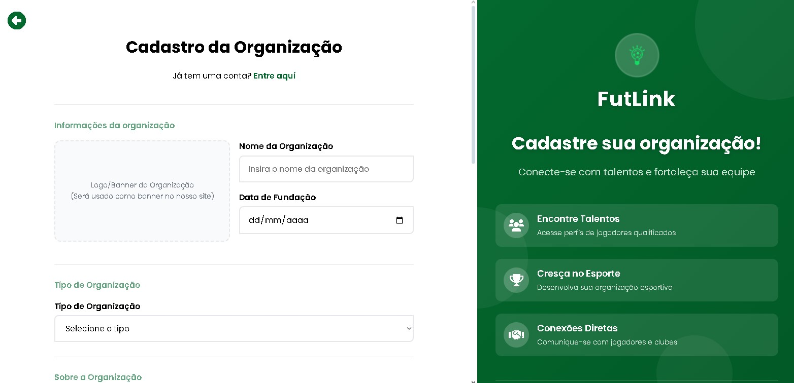

# FutLink
### *Conectando talentos ao futuro do futebol brasileiro*

---

## Sumário

- [Sobre o Projeto](#sobre-o-projeto)
- [Funcionalidades](#funcionalidades)
- [Demonstração](#demonstração)
- [Tecnologias](#tecnologias)
- [Nossa Equipe](#nossa-equipe)
- [Estrutura do Projeto](#estrutura-do-projeto)
- [Links Importantes](#links-importantes)
- [Licença](#licença)

---

## Sobre o Projeto

O **FutLink** é uma plataforma inovadora que revoluciona a forma como jogadores de futebol se conectam com clubes e organizações esportivas no Brasil.

### Nossa Missão
Democratizar o acesso às oportunidades no futebol, eliminando barreiras geográficas e sociais que impedem talentos de serem descobertos.

### O Problema que Resolvemos
- Jogadores talentosos sem visibilidade
- Clubes com dificuldade para encontrar novos talentos
- Falta de uma plataforma centralizada para o futebol brasileiro
- Processos burocráticos e caros para descoberta de talentos

### Nossa Solução
Uma plataforma digital completa onde jogadores podem:
- Criar perfis profissionais detalhados
- Compartilhar vídeos e estatísticas
- Se inscrever em peneiras e seletivas
- Ser descobertos por clubes de todo o Brasil

---

## Funcionalidades

| 👤 **Para Jogadores** | 🏢 **Para Organizações** | 👥 **Para Usuários** |
|:---:|:---:|:---:|
| 📝 Perfil profissional completo | 🔍 Busca avançada de talentos | 🌐 Exploração da plataforma |
| 🎥 Portfólio de vídeos | 📅 Criação de peneiras | 👀 Acompanhamento de jogadores |
| 🏆 Registro de conquistas | 📊 Relatórios detalhados | 💬 Interação com a comunidade |
| 📍 Oportunidades locais | 💬 Contato direto com jogadores | 📱 Conteúdo exclusivo |
| 🔔 Alertas personalizados | 🏆 Divulgação do clube | 🔗 Compartilhamento de perfis |

---

## Demonstração

### Interface da Plataforma

  

### Telas do Sistema

  
    
  
    
  

---

## Tecnologias

### Backend

### Frontend

### Ferramentas de Desenvolvimento

---

## Nossa Equipe

### Equipe Nexa Luminy - ETEC de Itaquera

<table align="center">
  <tr>
    <td align="center">
      <a href="https://github.com/DanielHMF">
         
        <b>Daniel Mattos</b>
      </a> 
      Documentation & Design Lead
    </td>
    <td align="center">
      <a href="https://github.com/edudausp">
         
        <b>Eduardo Fernandes</b>
      </a> 
      Full Stack & UI/UX Designer
    </td>
    <td align="center">
      <a href="https://github.com/thiagoConsta">
         
        <b>Thiago Ribeiro</b>
      </a> 
      Full Stack & UX/UI Designer
    </td>
  </tr>
  <tr>
    <td align="center">
      <a href="https://github.com/murimbo">
         
        <b>Murilo Magalhães</b>
      </a> 
      Backend Developer & ABNT Specialist
    </td>
    <td align="center">
      <a href="https://github.com/phmsantostts">
         
        <b>Pedro Medeiros</b>
      </a> 
      Full Stack Developer
    </td>
    <td align="center">
      <a href="https://github.com/Shandel-dev">
         
        <b>Shandel Villasante</b>
      </a> 
      Database Architect & Backend Dev
    </td>
  </tr>
</table>

*Estudantes apaixonados por tecnologia e futebol, unidos para transformar o esporte brasileiro*

---

## Estrutura do Projeto

\`\`\`
📦 FutLink/
├── 📂 app/                          # Lógica da aplicação
│   ├── 📂 controllers/              # Controladores PHP
│   └── 📂 views/                    # Páginas e componentes
├── 📂 config/                       # Configurações do sistema
├── 📂 database/                     # Scripts e estrutura do banco
│   └── 📂 db_futlink/              # Banco de dados principal
├── 📂 public/                       # Arquivos públicos
│   ├── 📂 css/                     # Estilos CSS
│   ├── 📂 js/                      # Scripts JavaScript
│   ├── 📂 images/                  # Imagens e assets
│   │   └── 📂 prints-site/         # Screenshots da plataforma
│   └── 📄 index.php                # Página inicial
├── 📂 storage/                      # Arquivos gerados
│   └── 📂 perfilIcons/             # Ícones de perfil dos usuários
└── 📄 README.md                     # Este arquivo
\`\`\`

---

## Links Importantes

---

## Licença

Este projeto está licenciado sob a **Licença MIT** - veja o arquivo [LICENSE](LICENSE) para mais detalhes.

---

### **Feito com muito amor e café pela Equipe Nexa Luminy**

**Se você gostou do projeto, não esqueça de dar uma estrela!**

